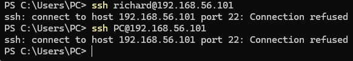
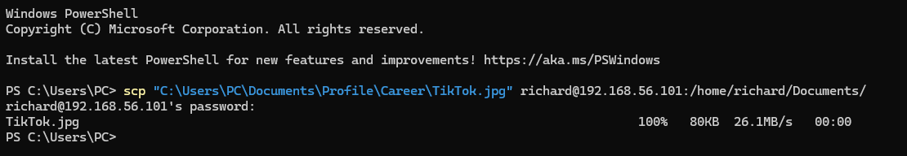

# SysOps Case Study: SSH & SCP from Windows to Ubuntu

## Overview
This repository documents a real-world beginner SysOps scenario:
securely connecting from a Windows host to an Ubuntu Linux VM
running in VirtualBox using SSH and SCP.

---

## Environment
- Host OS: Windows 10/11
- Guest OS: Ubuntu Linux (VirtualBox)
- Networking: NAT + Host-Only Adapter
- Tools: Windows Terminal (PowerShell), OpenSSH, SCP

---

## Problem Statement
- Initial SSH attempts failed due to VM networking isolation.
- Later SCP file transfers failed due to executing Windows paths
from a Linux environment.



---

## Root Cause Analysis
1. NAT networking prevented host access
2. SSH service was not running on Ubuntu
3. SCP was executed from the wrong OS context

---

## Resolution
- Added Host-Only Adapter
- Installed and enabled `openssh-server`
- Verified port 22 listening
- Executed SCP from Windows PowerShell


---

## Final Commands

### SSH (Connect to VM)
```bash ssh richard@192.168.56.101```

### SCP (Transfer file from Windows → Linux VM)
```bash scp "C:\Users\PC\Documents\Profile\Career\TikTok.jpg" richard@192.168.56.101:/home/richard/Documents/```


